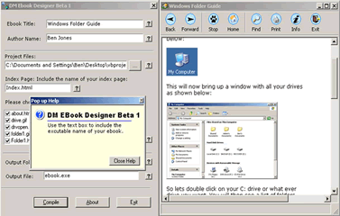



## eBookDesigner

### Description

This is a project I made over the last 2 Days that is used to compile html websites into eBooks. this also does compile to an exe file. This also does not unpack the files out to the windows temp folder and read them back in. this works by reading them from memory. as the content is stored in a res file in the exe.

Plus all you need is the compiler I made to make the eBooks. so you don;t need Vb resource editor. anyway I included source code for the compiler and the ebook viewed. I am planning on writtening the Viewer for the next version in Delphi. this will stop you from includeing the VB runtimes.

Well hope you like this project please vote.
 
### More Info
 

             |
---                |---
**Submitted On**   |2003-05-26 14:57:16
**By**             |[dreamvb](https://github.com/Planet-Source-Code/PSCIndex/blob/master/ByAuthor/dreamvb.md)
**Level**          |Intermediate
**User Rating**    |4.9 (68 globes from 14 users)
**Compatibility**  |VB 6\.0
**Category**       |[Complete Applications](https://github.com/Planet-Source-Code/PSCIndex/blob/master/ByCategory/complete-applications__1-27.md)
**World**          |[Visual Basic](https://github.com/Planet-Source-Code/PSCIndex/blob/master/ByWorld/visual-basic.md)
**Archive File**   |[eBookDesig16644510292003\.zip](https://github.com/Planet-Source-Code/dreamvb-ebookdesigner__1-49508/archive/master.zip)

